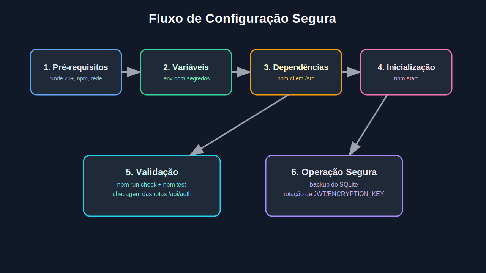

# Documentação de Configuração — Scaner Snipe-IT

Este documento é voltado para administradores e equipe técnica.



## 1) Pré-requisitos

- Node.js 20+.
- npm 10+.
- Acesso ao Snipe-IT com API Key válida.
- Linux recomendado para operação contínua.

## 2) Variáveis de ambiente

1. Na raiz do projeto, copie o arquivo:

```bash
cp .env.example .env
```

2. Configure os valores obrigatórios no `.env`:

- `SNIPE_URL`
- `JWT_SECRET`
- `ENCRYPTION_KEY`

3. Configure valores de segurança recomendados:

- `AUTH_MAX_ATTEMPTS`
- `AUTH_LOCK_MINUTES`
- `LOGIN_RATE_LIMIT_MAX`
- `CORS_ALLOWED_ORIGINS`

## 3) Instalação

```bash
cd src
npm ci
```

## 4) Verificações antes de subir

```bash
cd src
npm run check
npm test
```

## 5) Subir serviço

```bash
cd src
npm start
```

A aplicação abrirá na porta definida por `PORT` (padrão: `3000`).

## 5.1) Gerar compilado Vite (frontend estático)

```bash
cd src
npm run build:vite
```

Saída: `dist-vite/` na raiz do repositório.

## 5.2) Rodar em container HTTP simples (Nginx)

```bash
docker build -f Dockerfile.vite -t scaner-snipe-vite .
docker run --rm -p 8080:8080 scaner-snipe-vite
```

Abra: `http://localhost:8080/login`.

> Observação: esse container expõe apenas o frontend. O backend (`/api`) precisa estar acessível separadamente.

## 6) Endpoints principais

### Auth

- `POST /api/auth/register`
- `POST /api/auth/login`
- `POST /api/auth/change-password`

### Ativos/Snipe

- `GET /api/sipe/hardware/:id`
- `GET /api/sipe/asset/:id` (compatibilidade)

## 7) Hardening aplicado

- Headers de segurança com `helmet`.
- CORS restrito por whitelist (`CORS_ALLOWED_ORIGINS`).
- Rate limit de login.
- Bloqueio temporário por tentativas inválidas.
- Sanitização dos logs de autenticação.
- API Key armazenada criptografada (AES-256-GCM).
- SQLite com permissões restritas e PRAGMAs de segurança.

## 8) Operação e manutenção

### Backup

- Fazer backup periódico de `src/data/users.sqlite`.
- Salvar também `src/data/auth.log` para trilha de auditoria.

### Rotação de segredos

- Rotacionar `JWT_SECRET` periodicamente.
- Rotacionar `ENCRYPTION_KEY` com janela de manutenção.

### Monitoramento

- Alertar para crescimento anormal em `auth.log`.
- Monitorar erros 401/429/5xx.

## 9) Checklist de go-live

- [ ] `.env` preenchido com segredos fortes.
- [ ] CORS com domínios oficiais.
- [ ] `npm run check` sem erro.
- [ ] `npm test` sem erro.
- [ ] Login/cadastro/troca de senha validados.
- [ ] Fluxo de scanner e movimentação validado.
