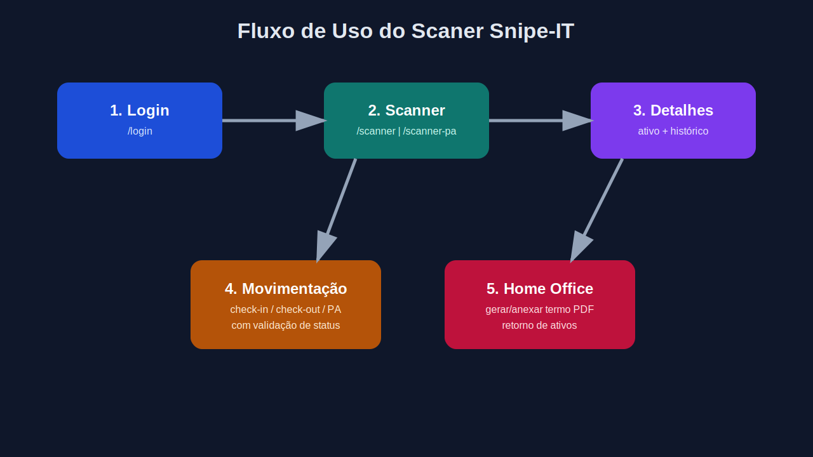

# Manual do Usuário — Scaner Snipe-IT

Este guia explica como usar o sistema no dia a dia (sem foco técnico de instalação).

## 1) Acesso ao sistema

1. Abra o navegador e acesse `/login`.
2. Informe sua **matrícula** e **senha**.
3. Clique em **Fazer login**.

> Se houver muitas tentativas inválidas, a conta pode ser bloqueada temporariamente por segurança.

## 2) Scanner principal

Após o login, você será direcionado para `/scanner`.

### O que pode ser feito:

- Consultar ativo por ID/tag.
- Ver dados de modelo, serial, status e responsável.
- Visualizar localização e informações de movimentação.

## 3) Scanner por PA

A página `/scanner-pa` permite buscar e filtrar ativos ligados a uma PA específica.

### Cenários comuns:

- Conferência em inventário.
- Triagem por localidade/PA.
- Conferência de retorno.

## 4) Movimentações (check-in / check-out / alteração de PA)

No fluxo de scanner, o usuário consegue:

- Fazer **check-out** para usuário.
- Fazer **check-in** de ativo.
- Atualizar dados de PA (campo customizado no Snipe-IT).

### Recomendações de uso:

- Sempre validar o ativo antes da movimentação.
- Conferir se o usuário de destino está correto.
- Verificar o status retornado após a operação.

## 5) Home Office

Na tela de Home Office, é possível:

- Gerar e anexar termo em PDF no ativo.
- Consultar ativos vinculados ao usuário de Home Office.
- Registrar retorno dos equipamentos.

## 6) Conta e segurança

### Cadastro de usuário

- Acesse `/usuario`.
- Informe matrícula, senha forte e API Key pessoal.
- O sistema criptografa a API Key no backend.

### Troca de senha

- Acesse `/change-password`.
- Informe senha atual + nova senha forte.

### Boas práticas para o usuário final

- Não compartilhar token/sessão.
- Encerrar uso em computadores compartilhados.
- Usar senha forte e única.
- Reportar erros de autenticação ao administrador.
